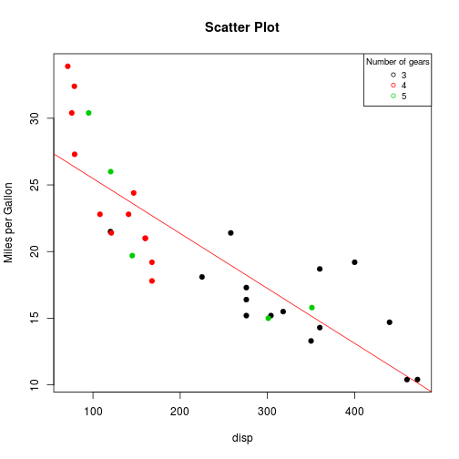

## App Scope

Main features:

1. Simple App.

2. Uses MTCars default dataset.

3. Perform simple linear analysis.

4. Gives a simple outlook of the relations between MPG and other variables.

--- .class #id 

## The regressors

The app performs a linear regression against one of the following regressors:

1. Cylinder Displacement (a.k.a. "disp").

2. Weight (a.k.a. "wt").

3. Engine Power (a.k.a. "hp").

4. Acceleration (a.k.a. "qsec").

The results of the overly complicated linear regression model are plot in a scatter plot of mpg vs the selected regressor plus an overimposed linear model fit. Brilliant!

--- .class #id

## The colors

The graphs from this app have colors! Sometimes more than two.

Several variables can be choosen in order to spice up even more the fantastic scatter plots.

In particular the following ones:

1. Number of cylinders (a.k.a. "cyl")

2. Number of gears (a.k.a. "gear")

3. Transmission type (a.k.a. "am")

--- .class #id

## The results

Here we can see an example of the results:

--- .class #id

## Thanks

Thanks for your attention.

Your mind must be ablaze after this presentation.

Please take 5 min to reflect upon this before you do anything important.

---
